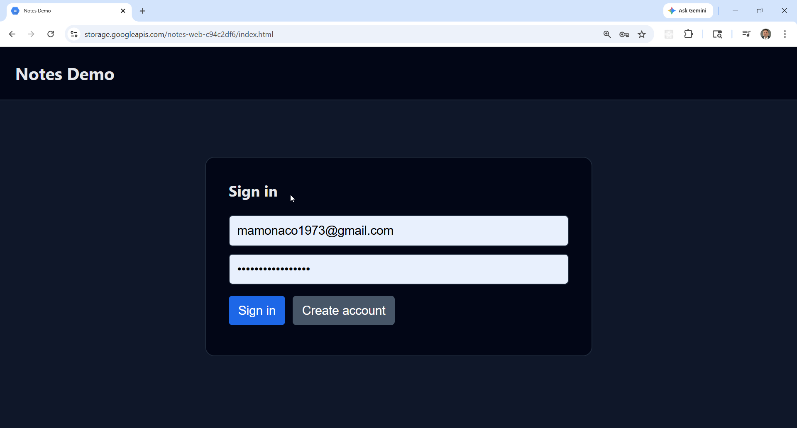
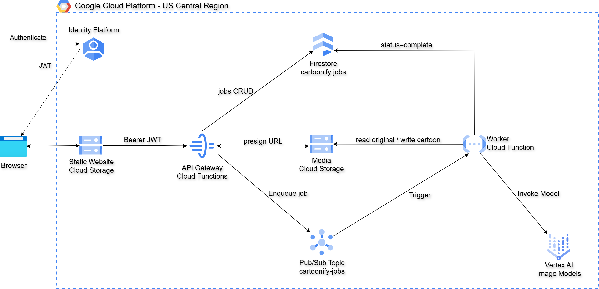
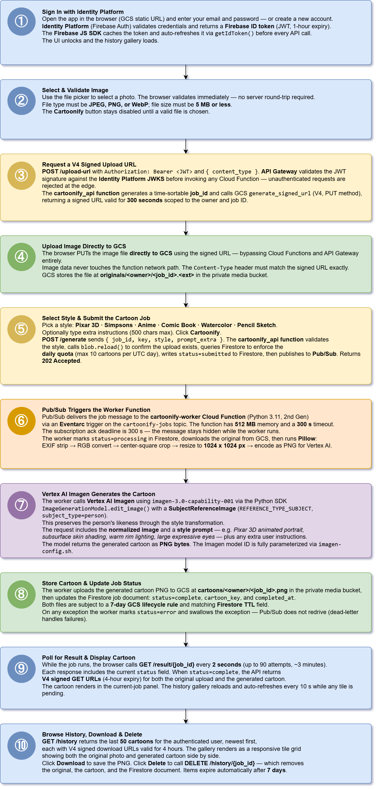

# GCP Serverless Image-to-Cartoon Pipeline with Vertex AI, Cloud Functions, Pub/Sub, and Identity Platform

This project delivers a fully automated **serverless, event-driven image
cartoonification service** on Google Cloud Platform, built using **Cloud API
Gateway**, **Cloud Functions 2nd Gen**, **Pub/Sub + Eventarc**, **Firestore**,
**Identity Platform**, **Vertex AI Imagen**, and **GCS**.

It uses **Terraform** and **Python** to provision and deploy an **asynchronous
image-processing pipeline** where users upload a photo, select a cartoon style,
and a Pub/Sub-driven worker invokes a **Vertex AI Imagen model** to produce a
stylized cartoon — all without running or managing any servers.

Authentication is handled by **Identity Platform** (Firebase Auth), allowing
users to sign in with email and password and obtain JWT tokens that are
validated directly by API Gateway before any Cloud Function is invoked.

A lightweight **HTML web frontend** integrates with the Firebase JS SDK,
allows direct browser-to-GCS uploads via V4 signed PUT URLs, polls for job
completion, and displays the user's full cartoon history — all over a
JWT-secured REST API.



The Vertex AI model is fully parameterized — see
[Changing the Model](#changing-the-model). Swapping models requires only
editing `imagen-config.sh`.

This design follows a **serverless, event-driven architecture** where API
Gateway routes authenticated requests to a single stateless Cloud Function,
Pub/Sub decouples the upload from the slow Vertex AI inference call, Firestore
provides fully managed job state, and GCS stores both originals and generated
cartoons. GCP handles scaling, availability, and fault tolerance automatically.

## Key Capabilities Demonstrated

1. **Asynchronous Image-Processing Pipeline** — Upload → Pub/Sub →
   Vertex AI worker → GCS result. The browser polls `/result/{job_id}` until
   the job completes, decoupling the user experience from inference latency.
2. **Vertex AI Imagen Subject Editing** — `imagen-3.0-capability-001` with
   `REFERENCE_TYPE_SUBJECT` preserves the person's likeness while regenerating
   the image in the requested cartoon style.
3. **Authenticated Serverless API** — Five REST routes handled by a single
   Cloud Function with internal routing, protected by Firebase JWT validation
   at the API Gateway layer.
4. **Single-Function API Pattern** — All five HTTP routes (`/upload-url`,
   `/generate`, `/result`, `/history`, `/history/{id}`) are consolidated into
   one `cartoonify_api` Cloud Function with internal routing — one deployment,
   one IAM binding, one Cloud Run service.
5. **Per-User Daily Quota** — `/generate` enforces a 10-cartoon-per-user-per-
   UTC-day limit using a Firestore range query on `created_at` with a composite
   index on `(owner, created_at ASC)`.
6. **Direct Browser-to-GCS Uploads** — `/upload-url` returns a V4 signed PUT
   URL scoped to the owner and job ID. The browser PUTs directly to GCS,
   keeping image data off the function network path.
7. **Firebase JWT Authentication** — Identity Platform issues and manages JWT
   tokens; API Gateway validates signatures against the Firebase JWKS before
   any Cloud Function runs, eliminating custom authentication logic.
8. **Infrastructure as Code** — Terraform provisions all resources across three
   discrete stages (backend → functions → webapp). Each stage has local state
   and can be applied or destroyed independently.

## Architecture



## Workflow



## Prerequisites

* [A Google Cloud Platform account](https://console.cloud.google.com/)
* [gcloud CLI](https://cloud.google.com/sdk/docs/install)
* [Terraform](https://developer.hashicorp.com/terraform/install)
* [jq](https://stedolan.github.io/jq/download/)
* A GCP service account JSON key saved as `credentials.json` in the repo root

The service account requires roles for: Cloud Functions, Cloud Run, Cloud
Build, Cloud Storage, Firestore, IAM, Identity Platform, API Gateway, API
Keys, Pub/Sub, and Vertex AI.

## Download this Repository

```bash
git clone https://github.com/mamonaco1973/gcp-cartoonify.git
cd gcp-cartoonify
```

## Build the Code

Run [check_env.sh](check_env.sh) to validate your environment, then run
[apply.sh](apply.sh) to provision all three stages.

```bash
~/gcp-cartoonify$ ./apply.sh
NOTE: gcloud found.
NOTE: terraform found.
NOTE: jq found.
NOTE: credentials.json found.
NOTE: Creating Firestore composite indexes (idempotent)...
NOTE: Imagen model imagen-3.0-capability-001 is reachable.
NOTE: Gemini model gemini-2.5-flash is reachable.
...
NOTE: gateway_url = https://cartoonify-gateway-<hash>-uc.a.run.app
...
================================================================================
  Cartoonify - Deployment validated!
================================================================================
  API : https://cartoonify-gateway-<hash>-uc.a.run.app
  Web : https://storage.googleapis.com/cartoonify-web-<hex>/index.html
================================================================================
```

Open the web URL, sign up, sign in, upload a photo, pick a style, and click
**Cartoonify**. The generated cartoon appears in roughly 20–40 seconds.

## Deployment Stages

| Stage | What it does |
|---|---|
| **01-backend** | Private GCS media bucket (CORS, 7-day lifecycle), Pub/Sub topic + subscription + DLQ, service accounts, IAM bindings, Identity Platform API key |
| **02-functions** | `cartoonify_api` Cloud Function (all 5 routes) + `cartoonify_worker` Pub/Sub-triggered function + API Gateway (OpenAPI spec, Firebase JWT auth) |
| **03-webapp** | Public GCS web bucket, generates `config.json`, deploys the SPA |

### Build Results

When the deployment completes, the following resources are created:

- **Core Infrastructure (Stage 01):**
  - Fully serverless — no VMs, VPCs, or load balancers
  - **GCS media bucket** (`cartoonify-media-<hex>`) — private, with CORS and
    7-day lifecycle rules on `originals/` and `cartoons/`
  - **Pub/Sub topic** (`cartoonify-jobs`) decoupling uploads from Vertex AI
    inference; subscription ack deadline 300s to accommodate inference latency
  - **Dead-letter topic** (`cartoonify-jobs-dlq`) with retry policy (10s–600s,
    max 5 attempts)
  - **Service accounts** — `cartoonify-api-sa` (signed URLs, Firestore,
    Pub/Sub) and `cartoonify-worker-sa` (GCS, Firestore, Vertex AI)
  - **Identity Platform API key** scoped to `identitytoolkit.googleapis.com`

- **Functions and Gateway (Stage 02):**
  - **`cartoonify_api`** — single Cloud Function (Python 3.11, 2nd Gen, private)
    handling all five HTTP routes with internal routing; 60s timeout
  - **`cartoonify_worker`** — Pub/Sub-triggered Cloud Function (Python 3.11,
    2nd Gen, 512 MB, 300s timeout); receives Eventarc messages from
    `cartoonify-jobs`, runs Pillow normalization + Vertex AI inference
  - **API Gateway** — OpenAPI 2.0 spec with a single global `x-google-backend`
    pointing to `cartoonify_api`; Firebase JWT security definition validates
    tokens against Identity Platform JWKS before the function is invoked
  - **Cloud Run IAM** — `cartoonify-gateway-sa` granted `roles/run.invoker`
    on the `cartoonify_api` Cloud Run service

- **Web Application (Stage 03):**
  - Vanilla JS SPA (no build step, no npm) uploaded to a public GCS bucket
  - `config.json` generated at deploy time with `apiKey`, `authDomain`,
    `projectId`, and `apiBaseUrl` — never committed to source control
  - Firebase JS SDK loaded from CDN; `getIdToken()` auto-refreshes tokens

- **Security and Authorization:**
  - API Gateway validates JWT signatures against Firebase JWKS before any
    Cloud Function is invoked — no authentication logic in application code
  - Firestore `owner` field is always set to the Firebase UID (`sub` claim) —
    users can only read or delete their own jobs
  - GCS media objects are never publicly accessible — all access is through
    short-lived V4 signed URLs generated by the API (4-hour GET URLs)
  - `cartoonify-api-sa` can publish to Pub/Sub but cannot invoke Vertex AI;
    `cartoonify-worker-sa` can invoke Vertex AI but has no API Gateway access

## API Gateway Endpoints

All endpoints (except OPTIONS) require `Authorization: Bearer <firebase_id_token>`.

| Method | Path | Purpose | Auth |
|---|---|---|---|
| POST | `/upload-url` | V4 signed PUT URL for direct GCS upload | Required |
| POST | `/generate` | Validate style, check quota, write Firestore, publish Pub/Sub | Required |
| GET | `/result/{job_id}` | Job status + signed GET URLs for original/cartoon | Required |
| GET | `/history` | Newest 50 jobs for the authenticated user | Required |
| DELETE | `/history/{job_id}` | Remove GCS objects and Firestore document | Required |

---

### POST /upload-url

**Purpose:**
Generates a V4 signed PUT URL allowing the browser to upload an image directly
to the private GCS media bucket without routing file data through the function.

**Request Body (JSON):**
```json
{ "content_type": "image/jpeg" }
```

| Field | Type | Required | Allowed values |
|---|---|---|---|
| content_type | string | Yes | `image/jpeg`, `image/png`, `image/webp` |

**Example Response (200):**
```json
{
  "job_id": "1745000000000-a1b2c3d4",
  "key": "originals/<uid>/1745000000000-a1b2c3d4.jpg",
  "upload_url": "https://storage.googleapis.com/cartoonify-media-<hex>/originals/...?X-Goog-Signature=..."
}
```

The browser PUTs the file body directly to `upload_url` with the matching
`Content-Type` header. The signed URL is valid for 300 seconds.

---

### POST /generate

**Purpose:**
Confirms the upload landed in GCS, checks the daily quota, writes a Firestore
job document with `status=submitted`, and publishes to `cartoonify-jobs`.

**Request Body (JSON):**
```json
{
  "job_id": "1745000000000-a1b2c3d4",
  "key": "originals/<uid>/1745000000000-a1b2c3d4.jpg",
  "style": "pixar_3d",
  "prompt_extra": "wearing a red cape, smiling"
}
```

| Field | Type | Required | Description |
|---|---|---|---|
| job_id | string | Yes | From `/upload-url` response |
| key | string | Yes | GCS key from `/upload-url` response |
| style | string | Yes | One of the six style IDs (see below) |
| prompt_extra | string | No | User-supplied prompt augmentation, max 500 chars |

**Supported Styles:**

| Style ID | Description |
|---|---|
| `pixar_3d` | Pixar 3D animated portrait with subsurface shading and cinematic lighting |
| `simpsons` | The Simpsons style — bright yellow skin, bold black outlines, flat colors |
| `comic_book` | Marvel comic book illustration with Ben-Day dots and dramatic ink shadows |
| `anime` | Japanese anime portrait with cel-shading, large luminous eyes, sharp lineart |
| `watercolor` | Fine art watercolor with wet-on-wet washes and visible paper texture |
| `pencil_sketch` | Detailed graphite sketch with cross-hatching and tonal shading |

**Example Response (202):**
```json
{ "job_id": "1745000000000-a1b2c3d4", "status": "submitted" }
```

**Quota exceeded (429):**
```json
{ "error": "Daily limit of 10 reached", "used": 10, "resets": "at 00:00 UTC" }
```

---

### GET /result/{job_id}

**Purpose:**
Returns the current status of a job plus short-lived V4 signed GET URLs for
the original upload and the generated cartoon (when complete).

**Example Response (200):**
```json
{
  "job_id": "1745000000000-a1b2c3d4",
  "status": "complete",
  "style": "pixar_3d",
  "created_at": 1745000000,
  "original_url": "https://storage.googleapis.com/cartoonify-media-<hex>/originals/...?X-Goog-Signature=...",
  "cartoon_url":  "https://storage.googleapis.com/cartoonify-media-<hex>/cartoons/...?X-Goog-Signature=..."
}
```

Signed GET URLs expire after 4 hours. `cartoon_url` is absent while the job
is `submitted` or `processing`.

---

### GET /history

**Purpose:**
Lists the newest 50 jobs for the authenticated user, each with signed GET URLs.

**Example Response (200):**
```json
{
  "items": [
    {
      "job_id": "1745000000000-a1b2c3d4",
      "status": "complete",
      "style": "pixar_3d",
      "created_at": 1745000000,
      "cartoon_url": "https://..."
    }
  ],
  "count": 1
}
```

---

### DELETE /history/{job_id}

**Purpose:**
Deletes the original and cartoon from GCS then removes the Firestore document.
Returns `404` if the job does not belong to the authenticated user.

**Example Response (200):**
```json
{ "job_id": "1745000000000-a1b2c3d4", "deleted": true }
```

---

## Changing the Model

The Vertex AI model is parameterized end-to-end. Edit [imagen-config.sh](imagen-config.sh) —
sourced by `apply.sh`, `destroy.sh`, and `check_env.sh`:

```bash
export IMAGEN_MODEL_ID="imagen-3.0-capability-001"
export GEMINI_MODEL_ID="gemini-2.5-flash"
```

These values flow automatically to:

- **`check_env.sh`** — probes both model endpoints before any Terraform runs
- **`02-functions/` Terraform** — injects `IMAGEN_MODEL_ID` as an env var on
  the worker Cloud Function
- **`code/worker/main.py`** — reads `IMAGEN_MODEL_ID` at startup

## Destroy

```bash
./destroy.sh
```

Tears down `03-webapp → 02-functions → backend`. Empties the media bucket,
deletes all `cartoonify_jobs` Firestore documents, then destroys backend
resources. Firestore composite indexes are managed outside Terraform (via
`api_setup.sh`) and are not deleted on destroy — they survive for the next
deploy.

## Cost Notes

- Vertex AI Imagen charges per image generated — verify current pricing at
  the [Vertex AI pricing page](https://cloud.google.com/vertex-ai/pricing).
- The 10-per-user/day quota caps worst-case Imagen spend at roughly
  **10 × image cost per active user per day**.
- Pub/Sub, Cloud Functions, Firestore, and GCS costs for this workload are
  negligible.

## Project Structure

```
gcp-cartoonify/
├── 01-backend/
│   ├── main.tf          Provider, service accounts, IAM bindings, outputs
│   ├── gcs.tf           Private media bucket (CORS, 7-day lifecycle rule)
│   ├── pubsub.tf        cartoonify-jobs topic + subscription + DLQ
│   └── identity.tf      Identity Platform browser API key
├── 02-functions/
│   ├── main.tf          Provider, source archives, GCS source bucket
│   ├── functions.tf     cartoonify_api + cartoonify_worker + API Gateway
│   ├── openapi.yaml.tpl Firebase JWT OpenAPI spec (single global backend)
│   └── code/
│       ├── api/         cartoonify_api — all 5 HTTP routes, internal routing
│       └── worker/      cartoonify_worker — Pub/Sub → Vertex AI → GCS
├── 03-webapp/
│   ├── main.tf
│   ├── public-bucket.tf
│   └── index.html.tmpl  Cartoonify SPA (Firebase Auth + V4 signed PUT upload)
├── apply.sh             3-phase deploy
├── destroy.sh           Reverse-order teardown with bucket + Firestore cleanup
├── api_setup.sh         Enable GCP APIs, Identity Platform, Firestore indexes
├── check_env.sh         Pre-flight: tools, credentials, Imagen + Gemini smoke tests
├── imagen-config.sh     Model selection (IMAGEN_MODEL_ID, GEMINI_MODEL_ID)
└── validate.sh          Post-deploy smoke test
```

See [CLAUDE.md](CLAUDE.md) for a deeper walkthrough of the data model,
IAM scoping, the worker pipeline, and how to modify styles and upload limits.
