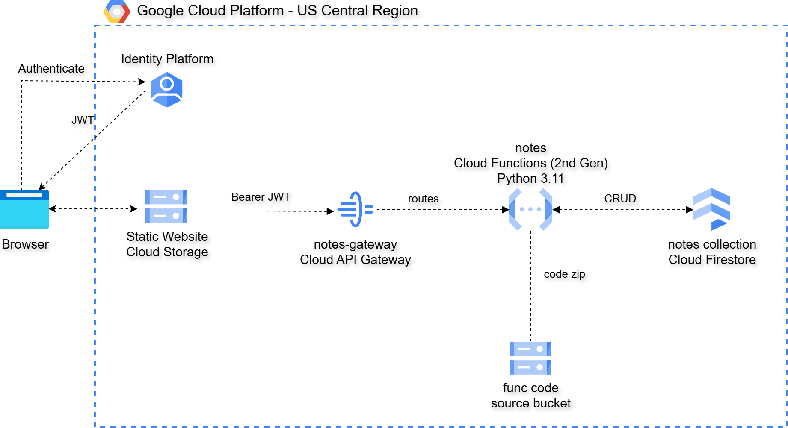

# GCP Serverless Authenticated Notes API

This project delivers a fully automated **serverless, authenticated CRUD API**
on Google Cloud Platform, built using **Cloud Functions (2nd Gen)**,
**Cloud Firestore**, **Cloud API Gateway**, and **Identity Platform**.

It uses **Terraform** and **Python** to provision and deploy a **stateless,
identity-aware REST backend** that exposes HTTP endpoints for managing notes —
all without running or managing any virtual machines or containers.

A lightweight **HTML web frontend** (served from Cloud Storage) handles user
sign-in and interacts directly with the API, allowing users to create, view,
update, and delete their own notes from a browser.


This design extends a basic serverless CRUD architecture with a full
authentication layer. Cloud API Gateway validates Firebase ID tokens before
any request reaches the Cloud Function, and per-user data isolation is enforced
in Firestore using the authenticated user's Firebase UID as the owner key.

Key capabilities demonstrated:

1. **Identity Platform Authentication** – Email/password sign-in backed by
   Google's Identity Platform (Firebase Auth). Each user gets a unique UID
   used to scope their data.
2. **JWT Validation at the Gateway** – Cloud API Gateway validates Firebase ID
   tokens against Identity Platform's JWKS before forwarding requests to the
   backend. The function never sees an unverified token.
3. **Per-User Data Isolation** – The Cloud Function extracts the Firebase UID
   from the verified JWT claims and uses it as the Firestore partition key.
   Users can only read and write their own notes.
4. **Private Cloud Function** – The Cloud Function is not publicly accessible.
   Only the API Gateway's service account holds `roles/run.invoker`.
5. **Serverless CRUD API** – A single Cloud Function routes all five REST
   operations internally by method and path — no separate routing layer needed.
6. **Managed NoSQL Storage** – Firestore (Native mode) provides low-latency,
   fully managed document persistence with no capacity planning required.
7. **Infrastructure as Code** – Terraform provisions all resources including
   Identity Platform configuration, API Gateway, API keys, IAM bindings, and
   Cloud Storage — in a repeatable, auditable way.

---

## Architecture



```
Browser (SPA on GCS)
     │
     ├── Loads config.json  (apiKey, authDomain, projectId, apiBaseUrl)
     ├── Signs in via Firebase JS SDK  (email / password)
     │   └── Returns Firebase ID token (JWT, 1-hour TTL, auto-refreshes)
     │
     └── API calls:  Authorization: Bearer <id_token>
          │
          ▼
     Cloud API Gateway
     ├── Validates JWT signature against Identity Platform JWKS
     ├── Rejects expired or invalid tokens (401)
     ├── Encodes verified claims → X-Apigateway-Api-Userinfo header
     └── Forwards to Cloud Run using gateway service account (OIDC)
          │
          ▼
     Cloud Function: notes  (Python 3.11, 2nd Gen, private)
     ├── Decodes X-Apigateway-Api-Userinfo → extracts sub (Firebase UID)
     ├── Routes by request.method + request.path
     └── Scopes all Firestore operations to owner = sub
          │
          ▼
     Firestore (Native mode)
     collection: notes  |  owner field: Firebase UID
```

---

## API Endpoints

All endpoints require `Authorization: Bearer <firebase_id_token>`.
OPTIONS requests (CORS preflight) are passed through without authentication.

The base URL after deployment is the Cloud API Gateway URL:
```
https://{gateway-id}-{hash}-uc.a.run.app
```

### Endpoint Summary

| Method | Path | Purpose | Auth |
|--------|------|---------|------|
| POST | `/notes` | Create a new note | Required |
| GET | `/notes` | List caller's notes | Required |
| GET | `/notes/{id}` | Get a single note | Required |
| PUT | `/notes/{id}` | Update a note | Required |
| DELETE | `/notes/{id}` | Delete a note | Required |

Notes are scoped to the authenticated user — a user cannot read or modify
another user's notes.

---

### POST /notes

Creates a new note owned by the authenticated user.

**Request Body (JSON):**
```json
{
  "title": "My Note",
  "note":  "Note body"
}
```

**Example Request:**
```bash
curl -s -X POST "${GATEWAY}/notes" \
  -H "Authorization: Bearer ${TOKEN}" \
  -H "Content-Type: application/json" \
  -d '{"title":"My Note","note":"Note body"}'
```

**Response (201):**
```json
{
  "id":    "2f2d0c5a-9f5f-4d7d-9e2c-1c8a5b8e3c21",
  "title": "My Note",
  "note":  "Note body"
}
```

---

### GET /notes

Lists all notes belonging to the authenticated user.

**Example Request:**
```bash
curl -s "${GATEWAY}/notes" -H "Authorization: Bearer ${TOKEN}"
```

**Response (200):**
```json
{
  "items": [
    {
      "owner":      "firebase-uid-abc123",
      "id":         "2f2d0c5a-9f5f-4d7d-9e2c-1c8a5b8e3c21",
      "title":      "My Note",
      "note":       "Note body",
      "created_at": "2026-01-19T14:12:09.123456+00:00",
      "updated_at": "2026-01-19T14:12:09.123456+00:00"
    }
  ]
}
```

---

### GET /notes/{id}

Retrieves a single note. Returns 404 if the note does not exist or belongs
to a different user.

```bash
curl -s "${GATEWAY}/notes/{id}" -H "Authorization: Bearer ${TOKEN}"
```

---

### PUT /notes/{id}

Updates an existing note. Returns 404 if the note does not exist or belongs
to a different user.

```bash
curl -s -X PUT "${GATEWAY}/notes/{id}" \
  -H "Authorization: Bearer ${TOKEN}" \
  -H "Content-Type: application/json" \
  -d '{"title":"Updated","note":"New body"}'
```

---

### DELETE /notes/{id}

Deletes a note. Returns 404 if the note does not exist or belongs to a
different user.

```bash
curl -s -X DELETE "${GATEWAY}/notes/{id}" -H "Authorization: Bearer ${TOKEN}"
```

---

## Obtaining a Token (CLI)

```bash
API_KEY=$(jq -r '.apiKey'    02-webapp/config.json)
GATEWAY=$(jq -r '.apiBaseUrl' 02-webapp/config.json)

TOKEN=$(curl -sf -X POST \
  "https://identitytoolkit.googleapis.com/v1/accounts:signInWithPassword?key=${API_KEY}" \
  -H "Content-Type: application/json" \
  -d '{"email":"you@example.com","password":"yourpassword","returnSecureToken":true}' \
  | jq -r '.idToken')
```

---

## Prerequisites

* [A Google Cloud Platform Account](https://console.cloud.google.com/)
* [Install gcloud CLI](https://cloud.google.com/sdk/docs/install)
* [Install Terraform](https://developer.hashicorp.com/terraform/install)
* [Install jq](https://stedolan.github.io/jq/download/)
* A GCP service account JSON key file saved as `credentials.json` in the repo root

The service account needs permissions to manage Cloud Functions, Firestore,
Cloud Storage, Cloud Run, Cloud Build, IAM, Identity Platform, API Gateway,
and API Keys.

## Download this Repository

```bash
git clone https://github.com/mamonaco1973/gcp-identity-app.git
cd gcp-identity-app
```

## Build the Code

Place your `credentials.json` in the repo root, then run [apply](apply.sh) to
provision all infrastructure.

```bash
~/gcp-identity-app$ ./apply.sh
NOTE: Running environment validation...
NOTE: Validating required commands...
NOTE: gcloud found.
NOTE: terraform found.
NOTE: jq found.
NOTE: credentials.json found.
NOTE: Authenticating with GCP project: my-project-id
NOTE: Enabling required GCP APIs...
NOTE: Enabling Identity Platform email/password sign-in...
NOTE: Identity Platform configured.
NOTE: Ensuring Firestore database exists in native mode...
NOTE: API setup complete.
NOTE: Deploying backend infrastructure...

Initializing the backend...
```

`apply.sh` runs in two phases:

1. **Backend** — deploys the Cloud Function, Identity Platform config, browser
   API key, API Gateway (API + config + gateway), and supporting IAM.
2. **Frontend** — generates `config.json` from Terraform outputs, copies
   `index.html.tmpl` → `index.html`, deploys the public GCS bucket.

### Build Results

When the deployment completes, the following resources are created:

- **Identity Platform** — email/password sign-in enabled; browser API key
  scoped to `identitytoolkit.googleapis.com`
- **Cloud API Gateway** — validates Firebase JWT tokens; forwards verified
  requests to the Cloud Function using a dedicated service account
- **Cloud Function (`notes`)** — private Python 3.11 function, accessible only
  via the gateway service account
- **Firestore collection (`notes`)** — documents keyed by UUID, scoped by
  Firebase UID owner field
- **Cloud Storage (webapp)** — public static site hosting `index.html` and
  `config.json`

## Teardown

```bash
./destroy.sh
```

Destroys the frontend bucket first, then all backend infrastructure.
